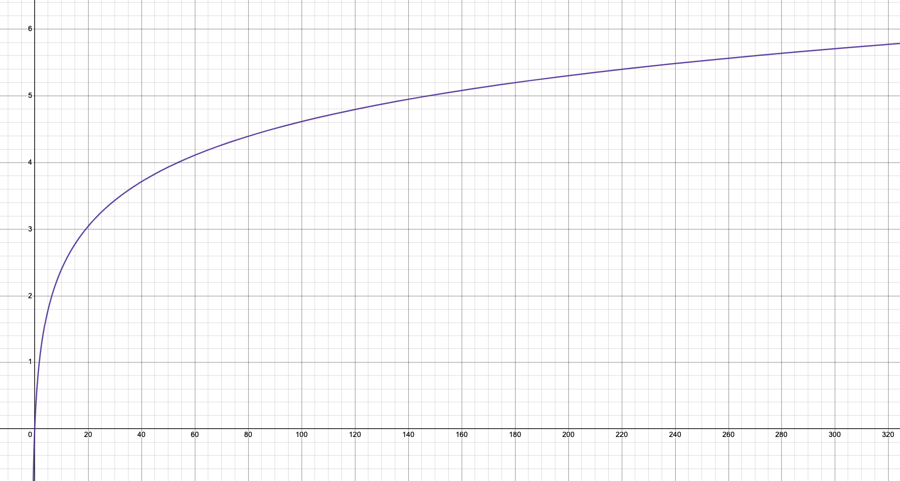
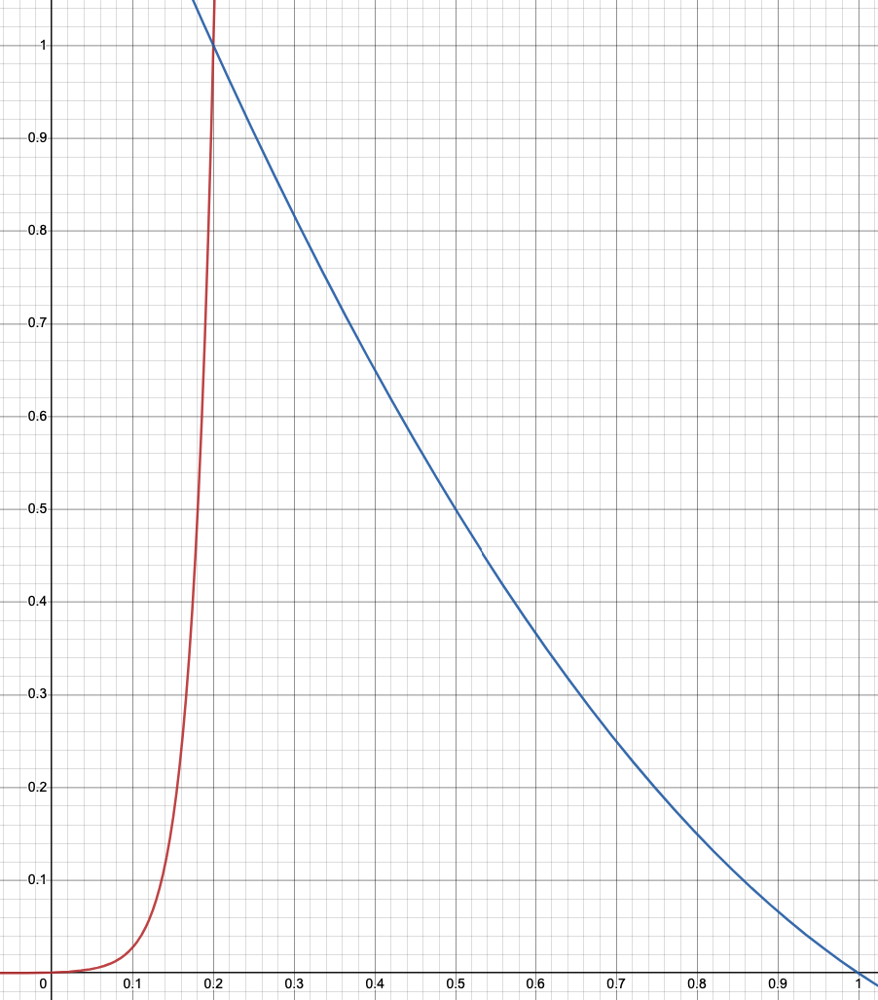

# Bro score by Bro_n_Bro

The qualitative validator set of each network from the cosmos ecosystem is the guarantee of sustainability and growth for each network. Validators have to produce blocks, keep uptime, vote on proposals. In addition, validators can submit proposals, develop new projects regarding the ecosystem and contribute to it. They get commission rewards from inflation according to the number of tokens are delegated to them. Moreover, the validator's voting power increases with delegated tokens.

The question is how to develop a qualitative validator set? How to distribute tokens for the Greate Justice? These questions will be clarified in this post. The provided rating should help to make decisions about delegation as for the newcomers and, also, for the oldfags.

It is a big deal for newcomers to choose a validator from the active validator set. All data is transparent but it is complex to find all parameters and make a conclusion manually. Experience has shown, however, that most newcomers are delegating their tokens for validators from top descended by voting power with a minimal possible commission. This is not a totally wrong decision, but there are more criteria for decision-making. Let's define them:

- cost optimization
- decentralization
- confidence
- reliability
- participation

These criteria are a summary of the validator activity.

## Criteria

The allocation of the delegation strategy programm is 100 points.

```python
ALLOCATION = 100
```

The criteria shares are:

```python
COST_OPTIMIZATION = 0.20
DECENTRALIZATION = 0.20
CONFIDENCE = 0.20
RELIABILITY = 0.20
PARTICIPATION = 0.20
```

## Cost optimization

Each hero decides which commission he wants to grab from their delegators. The mechanics provides resources for heroes to maintain their nodes in a highly reliable way. Some heroes skip this simple rule and keep zero-fee validators online for some kind of advertisement. On the other hand, some of the validators increase their commission rates up to 100%. Both of these cases are not encouraged. The distribution function for cost endorsement will be:

```python
def get_cost_optimization_endorsement(
        cost_optimization,
        cost_optimization_sum,
        ):
    return int(cost_optimization / cost_optimization_sum * ALLOCATION * COST_OPTIMIZATION)
```

where:
`cost_optimization_sum` is the sum of `cost_optimization` for all heroes
`cost_optimization` is:

```python
def get_cost_optimization(commission: float):
    if 0.01 <= commission <= 0.10:
        return 1 / (commission**2)
    else:
        return 0
```

This is a very easy function that gives a hero `1 / (commission**2)` if his commission rate is between 1% and 10% and gives 0 points otherwise.

## Decentralization

This criterion precedes the following goals:

- Increasing the number of heroes that can halt the network
- Increasing the number of heroes that can fork the network
- Supporting validators in the long tail, including sets of inactive heroes

The idea is to rank validators descending by staked tokens and to give them weighted points:

```python
def get_decentralization(rank):
    return math.log(rank + 1)
```



Then, distribute tokens:

```python
def get_decentralization_endorsement(decentralization, decentralization_sum):
    return int((decentralization / decentralization_sum) * ALLOCATION * DECENTRALIZATION)
```

## Confidence

The hero's confidence shows the relationship between the tokens that the hero has delegated to himself and the tokens that are delegated to him by the community. If the hero is not ready to put tokens on the validator he supports, then his confidence level is low. That is why only those heroes who believe in themselves will be encouraged. But, this is not very good if validator's tokens share more than 20%, like super newcomers shares or CEXes.

```python
def get_confidence(ownership):
    if 0.0 < ownership < 0.2:
        confidence = 0.000768996 * math.exp(35.8517 * ownership)
    else:
        confidence = 1.41667 - 2.25 * ownership + 0.833333 * ownership**2
    return confidence
```



And the distribution is:

```python
def get_confidence_endorsement(confidence, confidence_sum):
    return int((confidence / confidence_sum) * ALLOCATION * CONFIDENCE)
```

## Reliability

This criterion should help to understand the sustainability of the hero node set-up.

`tokens blurring` is the ratio between `staked` and `delegator_shares` tokens. It shows how many tokens a validator lost because of slashing. 

```python
def get_reliability(staked, delegator_shares):
    return staked / delegator_shares
```

The token loss is very serious misconduct. If the validator didn't lose anything, the `tokens_blurring` will be equal to 1.

The distribution is:

```python
def get_reliability_endorsement(reliability, reliability_sum):
    return int((reliability / reliability_sum) * ALLOCATION * RELIABILITY)
```

## Participation

This criterion shows the participation of the validator in governance proposals for the last 5 ended proposals for keeping rotation.

```python
import math

def get_superintelligence(power):
    return math.log10(power + 1)
```

The distribution is:

```python
def get_superintelligence_endorsement(superintelligence, superintelligence_sum):
    return int((superintelligence / superintelligence_sum) * ALLOCATION * SUPERINTELLIGENCE)
```

## Services

`main.py` - the script collects and calculates all data from networks defined in `config.py`

`api.py` - flask api service for serving it for frontend app